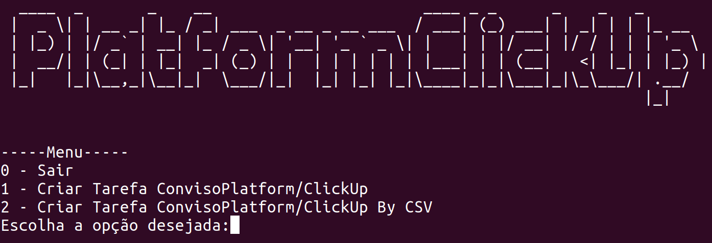

# PlatformClickup
App criada para adicionar um projeto no conviso platform e uma task no click-up. Será solicitado algumas informações e depois essas informações são adicionadas em ambos os sistemas. 

## Pré-requisitos
Python 3     
Install request --> pip3 requests       
Configurar duas variáveis de ambiente:     
 - **CONVISO_PLATFORM_TOKEN**:  api key do conviso platform
 - **CLICKUP_TOKEN**: token utilizado para realizar integrações no click-up

## Execução
Para iniciar a aplicação entre no diretório que você baixou e digite

 > python3 app.py

Aparecerá duas opções:
1. Criar Tarefa ConvisoPlatform/ClickUp
2. Criar Tarefa ConvisoPlatform/ClickUp By CSV

Agora basta seguinte as informações solicitadas na tela e será criado o projeto no Conviso Platform e também no Click-Up.